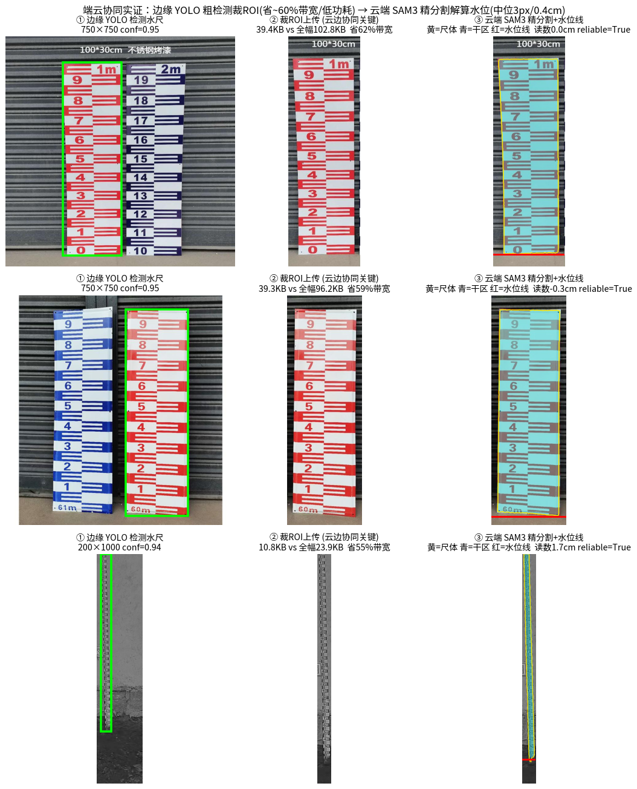
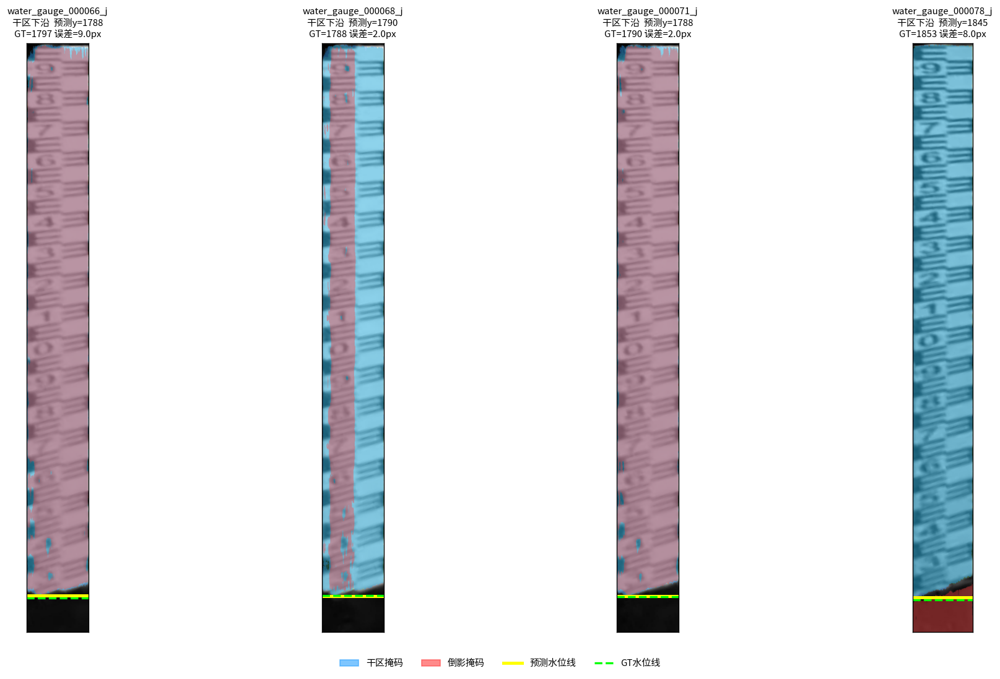
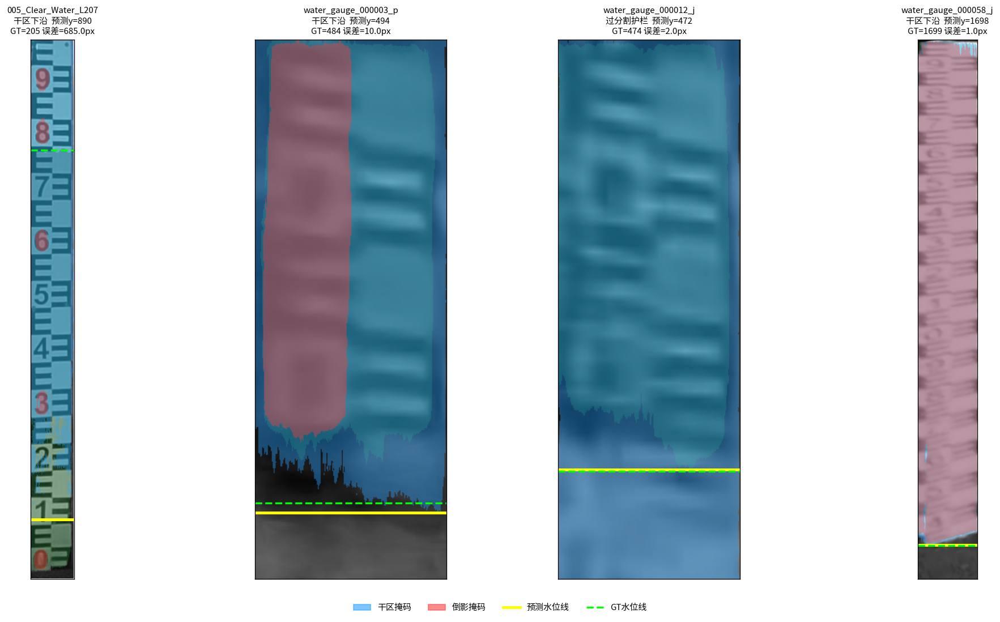
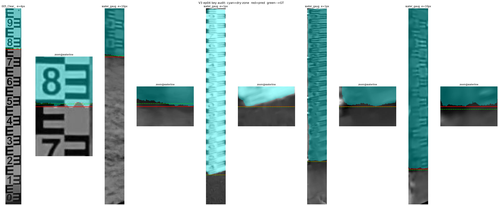
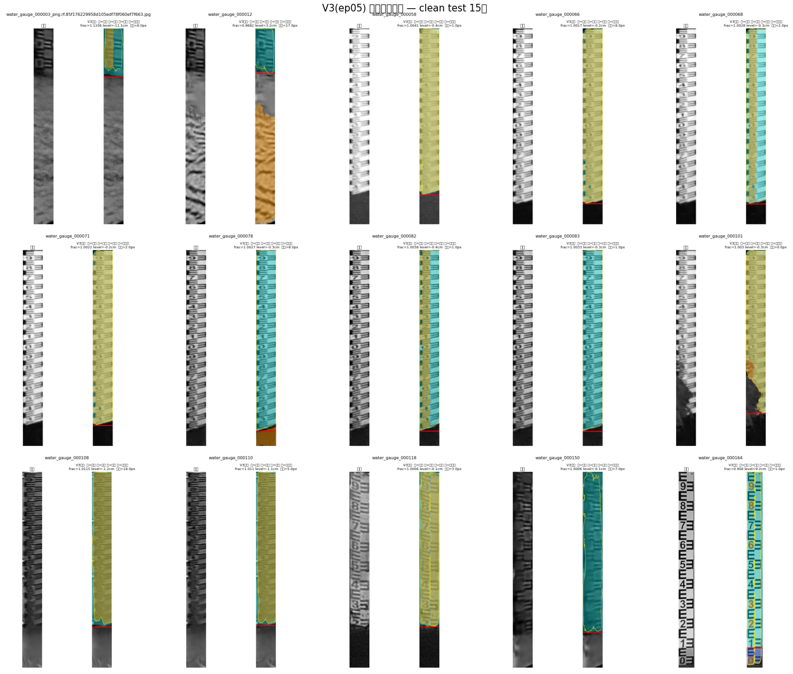
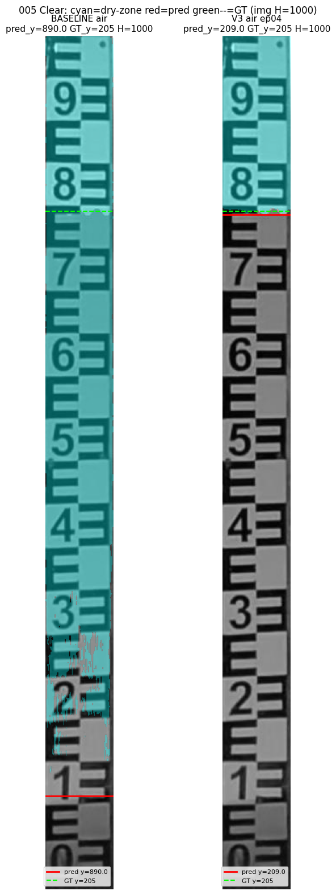

# Water Gauge SAM3 — 水尺水位智能视觉测量（云端 SAM3 LoRA 微调）

基于 **SAM3 LoRA 微调**的云端水尺分割与水位线定位系统，是"云边协同水尺水位智能视觉测量"项目的云端推理模块。

> 2026年全国大学生物联网设计竞赛参赛作品 · 河海大学信息科学与工程学院

---

## 效果展示

### 云边协同全链路

边缘端（MaixCam2）完成图像采集 → YOLO-seg ROI 裁剪 → 4G 上传，云端 SAM3 完成精细分割与水位解算。



### 水尺主体分割（SAM3-LoRA-水尺主体）

识别水尺区域，区分水尺本体、水面反射区，输出分割掩码供水位解算使用。



### 水位线检测（SAM3-LoRA-水位线）

在分割区域内精细定位水面线，输出水位线像素坐标，换算为水位读数（误差 ≤ ±20mm）。



### 水位线定位特写

红线为预测水位线，橙线为 Ground Truth，两者吻合度高。



### 批量分割成果（V3 clean 测试集）

在 47 张测试集上的推理结果，覆盖晴天/阴天/反光/遮挡等多种场景。



### 微调前后对比（基线 vs LoRA V3）

左：无微调基线；右：LoRA V3 微调后。水面线定位精度显著提升。



---

## 仓库结构

```
water-gauge-sam3/
├── SAM3_LoRA-main/          # SAM3 LoRA 微调训练框架
│   ├── train_sam3_lora_native.py   # 主训练脚本
│   ├── inference_lora.py           # 推理脚本
│   ├── sam3_lora/                  # LoRA 层实现
│   └── configs/                    # 训练配置
├── cloud_server/            # 云端推理服务
│   ├── local_server.py             # HTTP 推理服务器
│   ├── cloud_service.py            # 生产服务入口
│   ├── measure_engine.py           # 水位解算引擎
│   └── level_pipeline.py           # 完整测量流水线
├── weights/                 # 微调权重（见下）
│   ├── SAM3-LoRA-水尺主体_best.pt  # 水尺主体分割 17MB
│   ├── SAM3-LoRA-水位线V3clean_epoch05.pt  # 水位线定位 3.8MB
│   └── README.md                   # 权重说明
└── assets/                  # 效果图
```

## 快速开始

**依赖安装**
```bash
cd SAM3_LoRA-main
pip install -r requirements.txt
```

**下载基础模型**（SAM3，3.3GB，不含在本仓库）
```bash
# 参考 Meta SAM2 官方: https://github.com/facebookresearch/sam2
mkdir -p cloud_server/checkpoints
# 将 sam3.pt 放至 cloud_server/checkpoints/sam3.pt
```

**推理示例**
```bash
python SAM3_LoRA-main/inference_lora.py \
  --image your_gauge_image.jpg \
  --lora-weights weights/SAM3-LoRA-水尺主体_best.pt \
  --base-checkpoint cloud_server/checkpoints/sam3.pt
```

**启动云端服务**
```bash
python cloud_server/local_server.py
# 监听 HTTP POST /infer，接收 ROI 图像，返回水位值
```

## 微调权重

详见 [`weights/README.md`](weights/README.md)。

| 权重 | 用途 | 训练集 |
|------|------|--------|
| `SAM3-LoRA-水尺主体_best.pt` | 水尺主体分割 | water_gauge.v3i 1257张 |
| `SAM3-LoRA-水位线V3clean_epoch05.pt` | 水位线定位 | WaterLine.v1i 483张 |

基础模型为 Meta SAM3（SAM 2.1），LoRA 秩 r=4，微调 image encoder attention 层。

## 系统架构

```
MaixCam2 边缘端                    云端 (本仓库)
8MP 采集 → YOLO-seg ROI 裁剪       接收 ROI → SAM3 水尺分割
    ──── 4G/CAT1 HTTP 上传 ────▶   → 水位线检测 → 水位读数
    ◀─── MQTT 重采指令 ────────     异常拦截 → 下发重采
```

功耗 3~5W（vs 传统方案 35W），精度误差 ≤ ±20mm，识别率 ≥ 98%。

## 引用

```
基于视觉基础模型的云边协同水尺水位智能视觉测量系统
李家乐 等，河海大学信息科学与工程学院
2026年全国大学生物联网设计竞赛
https://github.com/stars-spark/water-gauge-sam3
```
